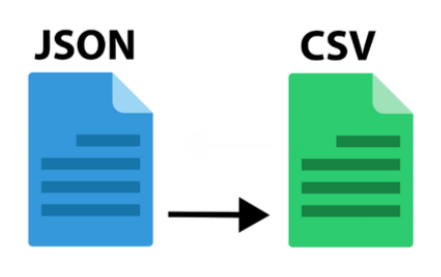

### Desafio Técnico: ETL Simples - JSON para CSV

**Objetivo:**
O objetivo deste desafio é avaliar a capacidade do candidato de ler dados de um arquivo JSON, transformá-los e exportá-los para um arquivo CSV utilizando a biblioteca pandas em Python.



**Descrição do Desafio:**
Crie um script em Python que realize as seguintes etapas do processo ETL (Extract, Transform, Load):

1. **Extract (Extração):**
   - Leia os dados de um arquivo JSON fornecido.
   
2. **Transform (Transformação):**
   - Realize algumas transformações nos dados. Exemplos de transformações podem incluir:
     - Filtragem de linhas ou colunas.
     - Limpeza de dados (tratar valores ausentes, remover duplicatas, etc.).
     - Modificação de tipos de dados.
     - Adição de novas colunas derivadas de dados existentes.
   
3. **Load (Carga):**
   - Exportar os dados transformados para um arquivo CSV.

**Requisitos Técnicos:**
- Utilize a biblioteca pandas para manipulação de dados.
- O código deve estar bem documentado e seguir boas práticas de programação.
- Inclua instruções claras sobre como executar o script e qualquer dependência necessária (arquivo requirements.txt, por exemplo).

**Arquivo JSON de Exemplo:**
Forneça um arquivo JSON simples para ser utilizado no desafio. Aqui está um exemplo de como pode ser o conteúdo do JSON:

```json
[
    {"estado": "SP", "vendas": 15000, "cerveja": "Pilsen", "carnaval": 2023},
    {"estado": "RJ", "vendas": 12000, "cerveja": "IPA", "carnaval": 2023},
    {"estado": "MG", "vendas": 8000, "cerveja": "Pilsen", "carnaval": 2023},
    {"estado": "BA", "vendas": 9500, "cerveja": "Stout", "carnaval": 2023}
]
```

**Instruções para o Candidato:**
1. Faça o download do arquivo JSON de exemplo fornecido.
2. Crie um script em Python que leia o arquivo JSON, realize algumas transformações nos dados e salve o resultado em um arquivo CSV.
3. Documente todas as transformações realizadas no script.
4. Envie o script Python (.py) e o arquivo CSV gerado como resultado.

**Critérios de Avaliação:**
- Correção do código.
- Qualidade das transformações realizadas.
- Organização e clareza do código.
- Documentação e instruções fornecidas.